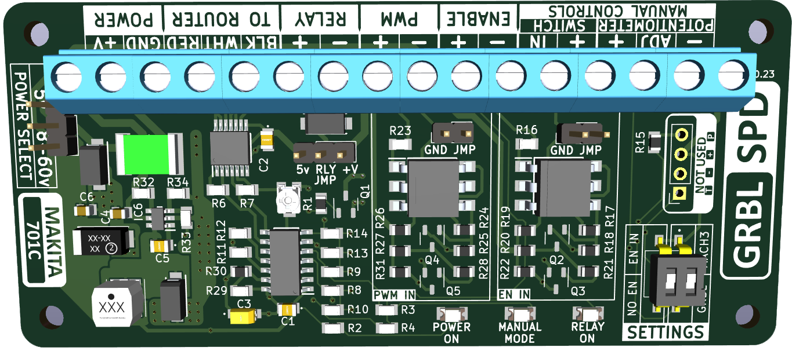

  
  
  <div align="center">
    <div style="display:inline-block; vertical-align: middle;">
      
    </div>
  </div> 

  <div align="center" >
  <a href="https://www.ebay.ca/itm/226146198705" style="margin-right:10px">
    
  </a>
  <a href="https://www.facebook.com/ThunderCNC" style="margin-right:10px">
    
  </a>
  <a href="http://www.youtube.com/@Thunder116fd" style="margin-right:10px">
    
  </a>
  <a href="https://www.instagram.com/thunder_cnc/" style="margin-right:10px">
    
  </a>
  <a href="https://www.linkedin.com/in/jon-harrison-01428557" style="margin-right:10px">
    
  </a>
  <a href="https://www.tindie.com/stores/gingertesla/?ref=offsite_badges&utm_source=sellers_GingerTesla&utm_medium=badges&utm_campaign=badge_medium">
    
  </a>
  </div>
  </br>
  </br>
  <p align="center" >Developed to integrate software control of the Makita 701C for use with but not limited to the Arduino Uno board (Flashed with GRBL 1.1)
  </p>
  <h2>ABOUT THE GRBL_SPD</h2>
  <p>
    This project allows for automatic control of a standard Makita 701C router for CNC machines. GRBL_SPD lets you set the rpm for your bits in software such as Vectric and have it automatically set your router. This cicuit replaces the potentiometer in the router and has an accuracy of approximately between +/- 100 to 200 RPM. In most cases this deviation has no impact on the machining process. You no longer have to turn on the router before sending the file, GRBL_SPD will do it for you. There are inputs for manual control which overrides the RPM setting in the GRBL file being sent. 
  </p></br>
  <h2>VERSIONS</h2>
  <div>
    <h4>Version 3 -- Discontinued</h4>
    <p> Reason: ATtiny84 microcontroller reached end of life.</p>
    <a title="Go to v3 page" href="versions/Version_3.md">
      
    </a>
  </div></br>
  <div>
    <h4>Version 4 -- Available</h4>
    <p> Upgraded to ATtiny1624 microcontroller</p>
    <a title="Go to v4 page" href="versions/Version_4.md">
      
    </a>
  </div></br>
  <!--<div>
    <h4>Version 5 -- Coming Soon</h4>
    <a title="Go to v5 page" href="versions/Version_5.md">
      
    </a>
  </div></br> -->


  <p> 
    <h2>Version 4 Features:</h2>
    <ul>
      <li>20MHz ATtiny1624 microcontroller</li>
      <li>10,000 to 30,000 RPM</li>
      <li>On/Off relay control</li>
      <li>Auto off when using manual override</li>
      <li>External manual controls</li>
    </ul>
  </p>


  <h2>Prerequisites:</h2>
    <ul>
      <li>+5v power and ground from CNC controller</li>
      <li>0-5v PWM signal from CNC controller</li>
      <li>1kHz PWM signal</li>
      <li>Sheilded cable between router and GRBL_SPD</li>
    </ul>


  <h2>Optional:</h2>
    <ul>
      <li>Connect relay for on/off function</li>
      <li>Potentiometer and switch for manual controls</li>
    </ul>

  <h3>Videos:</h3>
    <ul>
      <li>https://youtu.be/yv5z3KrGrSQ</li>
      <li>https://youtu.be/ecWwXNGC7Bc</li>
    </ul>

  <h4>Some users have tested with 240v Makita versions and have it functioning. I am not able to confirm this other than some video and testimony from those users. This board is designed for the Makita 701C so any other models will be experimenting at your own risk.</h4>

  Links to videos from Derek using the Makita 700C 240vac.
    <ul>
      <li>https://youtu.be/zJGl1yo-icU</li>
      <li>https://youtu.be/4u-4MBUV964</li>
    </ul>
  
  <h3><STRONG>WARNING!</STRONG> Voltages above 5v connected to this board will damage the microcontroller. If experimenting with controllers other than the standard Uno be sure to double check voltages and/or add protection to inputs. Zener and resistor for example.</h3>


  <h2>Controller Settings</h2>
 
 ```C 
GRBL 1.1  config.h

 #define VARIABLE_SPINDLE // Default enabled. Comment to disable.

 #define SPINDLE_PWM_MIN_VALUE 2 // Default disabled. Uncomment to enable. Must be greater than zero. Integer (1-255).
 ```

 ```C
GRBL settings

$30=30000
$31=10000
$32=0
 ```

 Depending on your sending software and controller setup there may be a setting for PWM frequency which should be 1kHz. There may also be settings for PWM voltage 0-5v or 0-10v so make sure it's set for 0-5v. A few different senders also have their own settings for min and max RPM so they should match the grbl settings. If your software/controller has mapping than you may need to set PWM accordingly so that 0% is off, 1 or 2% is min and 100% is max. 

 <h2> Connections</h2>
     <ul>
      <li>Power Input --> [+5v] and [GND] from controller 5v and ground</li>
      <li>PWM --> [PWM] 0-5v PWM from controller</li>
      <li>Router --> [RED] / [WHT] / [BLK] from router</li>
      <li>Relay --> [-] and [+] to relay coil</li>
      <li>Manual SW --> [IN] and [+] to switch</li>
      <li>Manual CTRL --> [-] / [ADJ] / [-] to potentiometer</li>
    </ul>
<a>
  
</a>
