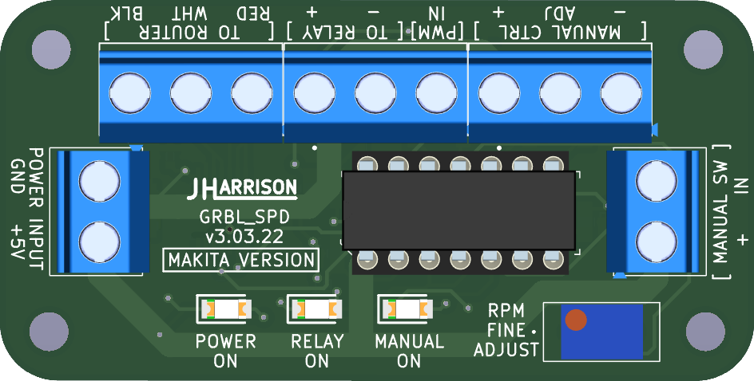
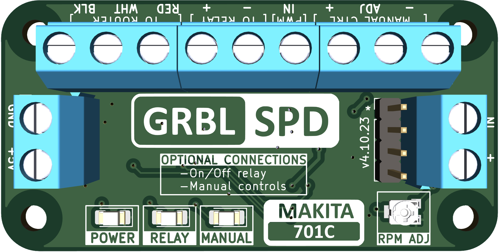

  
  
  

    

      
    

  
 

  

  
  
  
  
  
  
  

   
   
  
Developed to integrate software control of the Makita 701C for use with but not limited to the Arduino Uno board (Flashed with GRBL 1.1)
  

  <h2>ABOUT THE GRBL_SPD</h2>
  

    This project allows for automatic control of a standard Makita 701C router for CNC machines. GRBL_SPD lets you set the rpm for your bits in software such as Vectric and have it automatically set your router. This cicuit replaces the potentiometer in the router and has an accuracy of approximately between +/- 100 to 200 RPM. In most cases this deviation has no impact on the machining process. You no longer have to turn on the router before sending the file, GRBL_SPD will do it for you. There are inputs for manual control which overrides the RPM setting in the GRBL file being sent. 
  
 
  <h2>VERSIONS</h2>
  

    <h4>Version 3 -- Discontinued</h4>
    
 Reason: ATtiny84 microcontroller reached end of life.

    
  
 
  

    <h4>Version 4 -- Available</h4>
    
 Upgraded to ATtiny1624 microcontroller

    
  
 
  <!--

    <h4>Version 5 -- Coming Soon</h4>
    
  
  -->

  
 
    <h2>Features for Makita 701C:</h2>
    <ul>
      <li>10,000 to 30,000 RPM</li>
      <li>On/Off control</li>
      <li>External manual controls</li>
    </ul>
  

